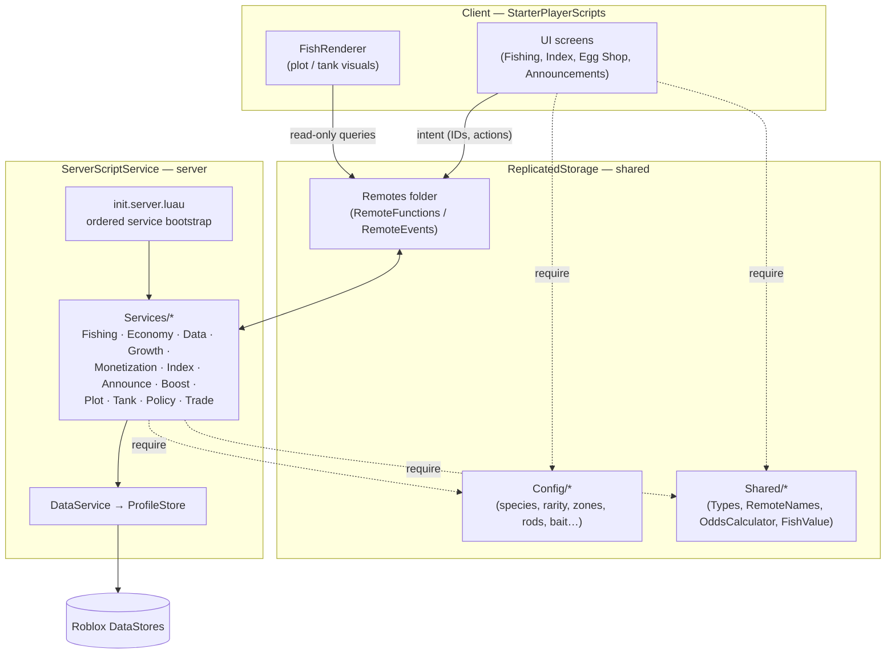

# Fish Game

A multiplayer fishing / aquarium-tycoon game for Roblox, written in Luau. Players fish across
progressively unlocked zones, catch species with randomised rarity, mutations and weight, then place
their catches in tanks on a personal plot where the fish grow and earn passive income. Coins buy
better rods, bait and new zones.

> **Status: actively in development.** The core loop (fish → sell / display → upgrade) is playable
> end to end. Some systems are still being built out — see [Development Status](#development-status).

This repository is primarily a showcase of the **backend / systems engineering**: a
server-authoritative simulation with persistent player data, a configurable probability engine, an
idempotent purchase pipeline and platform-policy compliance.

---

## Overview

- **Core concept.** Cast in a water zone → the server rolls a fish (rarity → species → mutations →
  weight) → it lands in your inventory. Sell it for coins, or place it in a tank on your plot where
  it slowly grows and generates passive income. Coins unlock stronger rods (better rarity odds),
  bait (better mutation odds) and additional zones with richer species pools.
- **What I built.** All of the code in `src/` — the client/server/shared architecture, every
  gameplay service, the probability engine, the data-persistence layer, the monetisation pipeline
  and every UI screen.
- **Engineering focus.** The game is deliberately **server-authoritative**: the client sends
  intent (IDs, button presses) and never values. All randomness, all currency math and all
  ownership checks happen on the server, every call.

---

## Technical Highlights

| Area | What's in the codebase |
| --- | --- |
| **Client / server split** | Client scripts render UI and send intent over remotes; the server owns all state. Shared code (types, config, pure math) lives in `ReplicatedStorage` and is consumed identically by both sides. |
| **Modular service architecture** | 12 server services, each a single-responsibility module exposing `.Init()`, wired up in one explicit, ordered bootstrap ([`init.server.luau`](src/server/init.server.luau)). No global state, no service locator — dependencies are plain `require`s. |
| **Server-authoritative validation** | Sell price is recomputed from the server's stored fish record; the fishing zone is derived from the player's server-tracked position, not a client value; tank ownership / capacity / inventory membership are re-checked on every placement. |
| **Probability engine** | [`OddsCalculator`](src/shared/Shared/OddsCalculator.luau) builds weighted rarity tables with **per-tier luck scaling**, and exposes a display path that rounds percentages with the **largest-remainder method** so the odds shown to players always sum to exactly 100% (a Roblox paid-random-item policy requirement). The same module feeds both the live roll and the disclosure UI, so they can never disagree. |
| **Data persistence** | [`DataService`](src/server/Services/DataService.luau) wraps **ProfileStore** with session locking. The live session object never leaves the module — callers get a plain data table matching [`ProfileTemplate`](src/shared/Config/ProfileTemplate.luau), with `:Reconcile()` handling schema migration. `GetPlotDisplay` returns a deliberately narrowed, read-only view for cross-player rendering. |
| **Idempotent monetisation** | [`MonetizationService`](src/server/Services/MonetizationService.luau) implements `ProcessReceipt`: purchase history is checked *before* granting and recorded *only after* the handler succeeds, so a retried receipt never double-grants. History is pruned after 90 days. |
| **Platform-policy compliance** | [`PolicyServiceWrapper`](src/server/Services/PolicyServiceWrapper.luau) checks `PolicyService` once per session, caches it, and **fails closed** (treats the player as restricted on any error). The shop swaps random-item listings for a guaranteed-purchase alternative when a player is restricted. |
| **Time-based simulation** | [`GrowthService`](src/server/Services/GrowthService.luau) advances fish growth and passive income on a heartbeat sweep and catches profiles up on join. Elapsed time is clamped (30 days) so a DataStore anomaly can't hand out a fortune. |
| **Config-driven design** | All balance data — 62 species, 7 rarity tiers, 7 mutations, 5 zones, rods, bait, products, tanks — lives in plain-table config modules under `src/shared/Config`. Tuning the game means editing data, not logic. |
| **Type safety** | Shared `export type` definitions ([`Types.luau`](src/shared/Shared/Types.luau)) for the fish record, rarity/mutation tiers and the full profile schema, used across services. |
| **Performance-aware rendering** | The fish renderer caps particle emitters and point lights per refresh and gives the scarce lights to the highest-value fish. |
| **Single source of truth for networking** | [`RemoteNames.luau`](src/shared/Shared/RemoteNames.luau) defines every remote name once; [`RemotesSetup`](src/server/Bootstrap/RemotesSetup.luau) creates the instances (`RemoteFunction` by default, `RemoteEvent` only for broadcasts). No stringly-typed remotes anywhere. |

---

## Architecture



**Interaction model**

1. The client builds its UI and calls a `RemoteFunction` (e.g. `CastLine`, `SellFish`, `BuyRod`).
2. The matching server service validates the request against the player's **profile** and
   **server-tracked world state**, mutates the profile in place, and returns a result.
3. ProfileStore persists the profile automatically on its save interval and on session end.
4. There is almost no server → client push: the one exception is `RareCatchAnnouncement`
   (`FireAllClients` on a Legendary+ catch). UIs poll lightweight read remotes on an interval to
   pick up out-of-band changes such as a completed purchase.

---

## Technologies

| Tool | Role |
| --- | --- |
| **Luau** | All game code (typed where it matters). |
| **Roblox Studio** | Runtime, play-testing, Script Analysis. |
| **[Rojo](https://rojo.space) 7.7.0** | Maps the `src/` filesystem tree into the Roblox DataModel and live-syncs during development. |
| **[Wally](https://wally.run) 0.3.2** | Luau package manager — pulls in `ProfileStore`. |
| **[Aftman](https://github.com/LPGhatguy/aftman)** | Pins the Rojo and Wally toolchain versions (`aftman.toml`). |
| **Git / GitHub** | Version control. |

---

## Project Structure

```
src/
├── client/                     # LocalScripts — UI + rendering only, no authority
│   ├── init.client.luau        # client entry point
│   ├── FishRenderer.client.luau # renders each plot's placed fish (+ VFX budgeting)
│   └── UI/
│       ├── FishingUI.client.luau      # cast button, inventory, sell / place
│       ├── IndexUI.client.luau        # fish-dex: species caught + best catch
│       ├── EggShopUI.client.luau      # paid random items + live odds disclosure
│       └── AnnouncementUI.client.luau # server-wide rare-catch banner
│
├── server/                     # Server-authoritative game logic
│   ├── init.server.luau        # ordered service bootstrap
│   ├── Bootstrap/
│   │   └── RemotesSetup.luau   # creates every remote from RemoteNames
│   └── Services/
│       ├── DataService.luau            # ProfileStore sessions, profile access
│       ├── FishingService.luau         # the roll engine + cast handling
│       ├── EconomyService.luau         # sell, unlock zone, buy/equip rod, buy bait
│       ├── GrowthService.luau          # growth + passive income over time
│       ├── MonetizationService.luau    # ProcessReceipt, product handlers
│       ├── IndexService.luau           # fish-dex tracking
│       ├── AnnounceService.luau        # server-wide rare-catch broadcast
│       ├── BoostService.luau           # Luck Potion (temporary luck multiplier)
│       ├── PlotService.luau            # assigns a physical plot per player
│       ├── TankService.luau            # place / remove fish in tanks
│       ├── PolicyServiceWrapper.luau   # PolicyService, cached, fail-closed
│       └── TradeService.luau           # trade policy gate (trading itself is WIP)
│
└── shared/                     # Replicated to both client and server
    ├── Config/                 # all balance data as plain tables
    │   ├── FishConfig.luau     # 62 species: value, weight range, grow rate
    │   ├── RarityConfig.luau   # 7 tiers: weight, value multiplier, luck scaling
    │   ├── MutationConfig.luau # 7 mutations: chance, multiplier, exclusivity
    │   ├── ZoneConfig.luau     # 5 zones: weight overrides, unlock cost, species pools
    │   ├── RodConfig.luau / BaitConfig.luau / BoostConfig.luau
    │   ├── ProductConfig.luau  # dev-product / gamepass definitions
    │   ├── TankConfig.luau
    │   └── ProfileTemplate.luau # default player profile
    └── Shared/
        ├── Types.luau          # shared type definitions
        ├── RemoteNames.luau    # single source of truth for remote names
        ├── OddsCalculator.luau # weighted odds + policy-compliant rounding
        └── FishValue.luau      # deterministic fish valuation

default.project.json            # Rojo: filesystem → DataModel mapping + world objects
aftman.toml                     # pinned toolchain (rojo, wally)
wally.toml / wally.lock         # Luau dependencies
CLAUDE.md                       # extended architecture notes
```

---

## Key Systems

- **Fishing roll engine** — [`FishingService`](src/server/Services/FishingService.luau).
  `GenerateFish` is the single entry point: roll rarity (zone weights × luck), pick a species from
  that zone/rarity pool, roll mutations (an exclusive "Rainbow" check first, then independent
  stacking rolls capped at 3), roll a weight from a triangular-ish distribution. `OnCastLine` adds
  the cooldown check, the zone-lock check and bait consumption around it.
- **Odds calculation & disclosure** — [`OddsCalculator`](src/shared/Shared/OddsCalculator.luau) +
  [`EggShopUI`](src/client/UI/EggShopUI.client.luau). The shop's "Details" panel shows live
  per-tier percentages that update while open if a Luck Potion activates or expires.
- **Player data** — [`DataService`](src/server/Services/DataService.luau) +
  [`ProfileTemplate`](src/shared/Config/ProfileTemplate.luau). Session-locked profiles, schema
  reconciliation, kick-on-session-end, yield-until-loaded reads.
- **Economy** — [`EconomyService`](src/server/Services/EconomyService.luau). Sell (server
  recomputes value), unlock zone (spend coins), buy rod (own once, equip persistently), buy bait
  (consumable stack).
- **Growth & passive income** — [`GrowthService`](src/server/Services/GrowthService.luau). Only
  tank-placed fish grow and earn; a fully-grown fish keeps earning; a heartbeat sweep plus on-join
  catch-up, both with clamped elapsed time.
- **Monetisation** — [`MonetizationService`](src/server/Services/MonetizationService.luau).
  Idempotent `ProcessReceipt`, per-product handlers keyed by dev-product ID, eggs that roll real
  fish at the buyer's current luck.
- **Fish valuation** — [`FishValue`](src/shared/Shared/FishValue.luau).
  `BaseValue × rarity multiplier × weight variance × Π(mutation multipliers) × growth bonus`,
  deterministic and shared by the sell path, passive income and the index's "best catch" scoring.

---

## Development Status

The project is being built in phases. Current state:

**Playable now**

- Full fishing loop: cast, roll, inventory, sell.
- 5 zones / 62 species / 7 rarity tiers / 7 mutations, all config-driven.
- Persistent profiles (ProfileStore) with schema reconciliation.
- Rod and bait progression; coin-gated zone unlocks.
- Tanks: place / remove fish, growth and passive income over time.
- Fish index (dex) with per-species best-catch tracking.
- Server-wide rare-catch announcements.
- Monetisation: dev products (eggs, coin packs, Luck Potion, extra plot slot, guaranteed fish)
  with an idempotent receipt pipeline, plus PolicyService-compliant odds disclosure and a
  restricted-account purchase path.

**In progress / scaffolded**

- **Trading** — the `PolicyService` gate is wired
  ([`TradeService`](src/server/Services/TradeService.luau)); the trade flow itself is intentionally
  the last system to be built (highest abuse surface).
- **Fish rendering** — [`FishRenderer`](src/client/FishRenderer.client.luau) currently draws
  placeholder parts polled on an interval; a single-heartbeat batched renderer with distance
  culling is planned.
- **Gamepasses** — defined in [`ProductConfig`](src/shared/Config/ProductConfig.luau)
  (Double Growth, VIP, Auto-Fish, Double Coins) but not yet applied by the services.
- **Profile schema** carries fields for planned features not yet implemented (`gems`,
  `dailyStreak`, `lastLogin`, multiple tank tiers).
- **Debug remotes** — several services expose `Debug*` remotes used for play-testing; these are
  slated to be stripped out in a pre-publish hardening pass.

---

## Running Locally

**Prerequisites:** [Aftman](https://github.com/LPGhatguy/aftman), Roblox Studio.

```bash
# 1. Install the pinned toolchain (Rojo, Wally)
aftman install

# 2. Fetch Luau dependencies (ProfileStore → ServerPackages/)
wally install

# 3. Build a place file...
rojo build -o "place.rbxlx"
#    ...open it in Studio, then start the live-sync server:
rojo serve
```

In Studio, connect via the **Rojo** plugin to pick up changes as you edit. ProfileStore requires
**API access to Studio** to be enabled (Game Settings → Security) for data to save in Studio tests.

---

## Development

| Command | Purpose |
| --- | --- |
| `aftman install` | Install pinned `rojo` + `wally`. |
| `wally install` | Fetch dependencies into `ServerPackages/` (git-ignored). |
| `rojo build -o place.rbxlx` | Build a place file from source. |
| `rojo serve` | Start the live-sync server for Studio. |
| `rojo sourcemap -o sourcemap.json` | Generate a sourcemap for the Luau Language Server. |

There is no automated test/lint tooling wired up yet — verification is Studio's Script Analysis
plus play-testing. `init.server.luau` prints a sampled rarity distribution on start as a quick
sanity check on `OddsCalculator` while tuning.

[`CLAUDE.md`](CLAUDE.md) contains extended architecture notes (service init order, the remote
convention, the anti-exploit model).

---

## Future Work

Reasonably implied by the current codebase:

- Build the actual trading flow behind the existing policy gate.
- Replace the placeholder fish renderer with a batched, culled renderer.
- Wire up the defined gamepasses and the unused profile fields (`gems`, daily streak).
- Multiple tank tiers (config currently has one).
- Add automated checks: a linter (Selene), a formatter (StyLua) and unit tests around the pure
  modules (`OddsCalculator`, `FishValue`).
- Remove the `Debug*` remotes for a production build.